## 插件目录 <sub><a href="#user-content-installation">安装说明</a></sub>

| 插件 | 当前版本 | 更新时间 | 简介 | 下载 | 前置插件 |
| --- | --- | --- | --- | --- | --- |
| [globals](#user-content-globals) | — | — | 前置插件 | [](https://github.com/Yunxei/jingxia/releases/download/globals/globals.zip) | — |
| [TimeUntil](#user-content-timeuntil) | 4.9 | 2026-10-04 | 活动/地区时间 | [](https://github.com/Yunxei/jingxia/releases/download/timeuntil-v4.9/TimeUntil-4.9.zip) | globals |
| [Panoptes](#user-content-panoptes) | 1.3 | 2026-10-04 | 玩家状态追踪 | [](https://github.com/Yunxei/jingxia/releases/download/panoptes-v1.3/Panoptes-1.3.zip) | globals |
| [packratio](#user-content-packratio) | 2.7 | 2026-10-04 | 显示地区货率 | [](https://github.com/Yunxei/jingxia/releases/download/packratio-v2.7/packratio-2.7.zip) | — |
| [speedometer](#user-content-speedometer) | 2.0 | 2026-10-04 | 载具速度显示 | [](https://github.com/Yunxei/jingxia/releases/download/speedometer-v2.0/speedometer-2.0.zip) | globals |
| [ReloadButton](#user-content-reloadbutton) | 1.0 | 2026-10-04 | 快速重载插件 | [](https://github.com/Yunxei/jingxia/releases/download/reloadbutton-v1.0/ReloadButton-1.0.zip) | — |
| [Nyxaria](#user-content-nyxaria) | 2.0 | 2026-10-04 | 背包整理 | [](https://github.com/Yunxei/jingxia/releases/download/nyxaria-v2.0/Nyxaria-2.0.zip) | — |
| [combatcloset](#user-content-combatcloset) | 2.4 | 2026-10-04 | 装备与称号一键切换 | [](https://github.com/Yunxei/jingxia/releases/download/combatcloset-v2.4/combatcloset-2.4.zip) | — |
<br>

> 点击下方插件详情标题展开详细说明。

<br>
<details>
<summary>安装说明</summary>

<a id="installation"></a>

```text
下载压缩包后解压文件夹，将文件夹放入：
X:\My Documents\ArcheRage\Addon

注意：
X 不是固定盘符，它代表你电脑上“文档”文件夹所在的盘。

不同系统：
• Win10/Win11 中文：文档
• Win7 中文：我的文档
• 英文系统：Documents / My Documents

请不要直接复制 X。
```

</details>

<details>
<summary> globals ｜ 前置插件</summary>

<a id="globals"></a>

- globals 是部分插件运行所需的前置插件
- 当前已确认 TimeUntil、Panoptes、speedometer 使用 globals
- 多个插件共用同一个 globals，只需安装一份

<picture></picture> **下载**

**globals** 

[](https://github.com/Yunxei/jingxia/releases/download/globals/globals.zip)

</details>

<details>
<summary> TimeUntil 4.9 ｜ 活动/地区时间</summary>

<a id="timeuntil"></a>

<picture></picture> **插件说明**

用于查看地区状态、活动时间以及相关倒计时。

<picture></picture> **主要功能**

- 地区和平 / 纷争 / 战争时间显示
- 游戏活动时间与倒计时
- 部分活动的任务完成进度显示
- 自定义显示内容
- 活动显示数量设置
- 主界面显示 / 隐藏
- 配置与界面状态保存

<p>
  <a href="https://github.com/user-attachments/assets/8016ff07-c841-4f87-9c5a-e8a5ba173e84"></a>
  <a href="https://github.com/user-attachments/assets/e1152bcb-71c2-4c35-bb2b-b6eb0f44c774"></a>
  <a href="https://github.com/user-attachments/assets/b813b0c1-d967-4cee-8962-09bd14cd8e6f"></a>
</p>


<picture></picture> **下载**

**TimeUntil 4.9** 

[](https://github.com/Yunxei/jingxia/releases/download/timeuntil-v4.9/TimeUntil-4.9.zip)

<picture></picture> 需要前置插件：

[](https://github.com/Yunxei/jingxia/releases/download/globals/globals.zip)

第一次安装需要同时安装 globals；已经安装过则无需重复安装。

<picture></picture> **更新记录**

`4.9`

当前正式发布版本。

</details>

<details>
<summary> Panoptes 1.3 ｜ 玩家状态追踪</summary>

<a id="panoptes"></a>

<picture></picture> **插件说明**

用于显示和追踪自身、目标的状态，提供悬浮面板、头顶标记和屏幕提示等辅助显示。

<picture></picture> **主要功能**

- 自身与目标状态追踪、剩余时间及层数显示
- 悬浮面板与头顶标记
- 目标信息、装备评分与距离显示
- 重要状态屏幕提示，以及自身 / 目标被扒皮等级提示
- 自身装备图标显示
- 大施法条显示与设置
- 进团时按职业自动设置团队职责
- 所有功能均可自由改变位置与开关
- 追踪清单管理与配置保存


<p>
  <a href="https://raw.githubusercontent.com/Yunxei/jingxia/main/assets/screenshots/Panoptes/preview-01.png">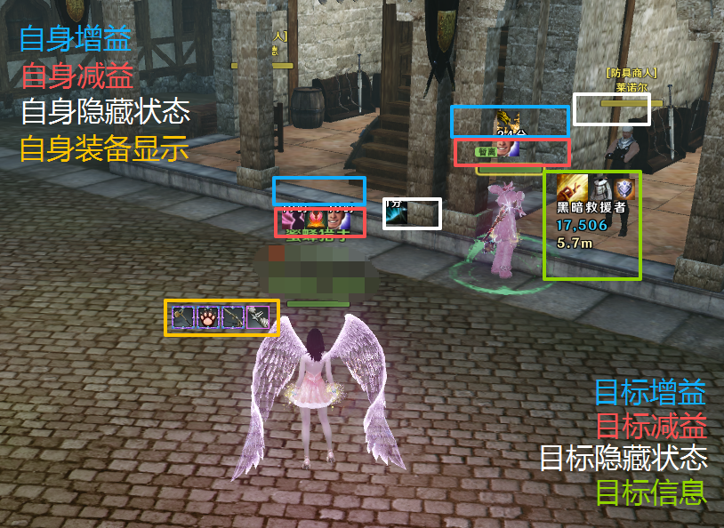</a>
  <a href="https://raw.githubusercontent.com/Yunxei/jingxia/main/assets/screenshots/Panoptes/preview-02.png">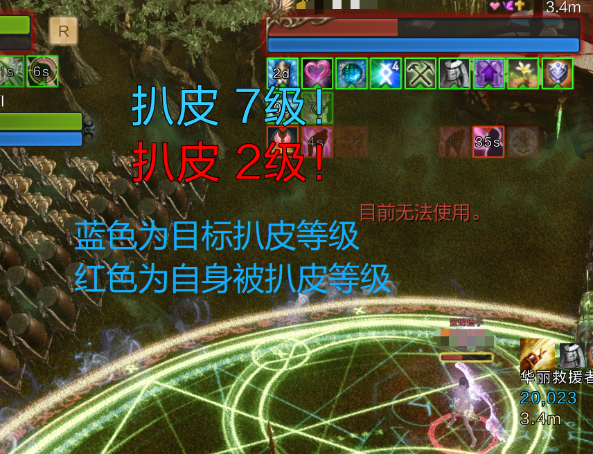</a>
  <a href="https://raw.githubusercontent.com/Yunxei/jingxia/main/assets/screenshots/Panoptes/preview-03.png">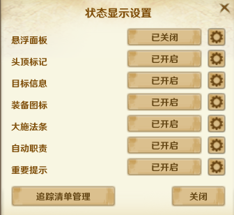</a>
</p>

<p>
  <a href="https://raw.githubusercontent.com/Yunxei/jingxia/main/assets/screenshots/Panoptes/preview-04.png">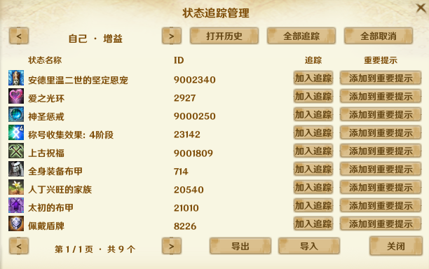</a>
  <a href="https://raw.githubusercontent.com/Yunxei/jingxia/main/assets/screenshots/Panoptes/preview-05.png">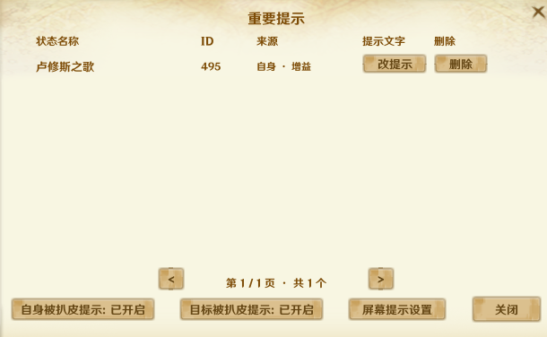</a>
</p>

<picture></picture> **下载**

**Panoptes 1.3**

[](https://github.com/Yunxei/jingxia/releases/download/panoptes-v1.3/Panoptes-1.3.zip)

<picture></picture> **前置插件**

需要前置插件：globals。

[](https://github.com/Yunxei/jingxia/releases/download/globals/globals.zip)

第一次安装需要同时安装 globals；已经安装过则无需重复安装。

<picture></picture> **更新记录**

`1.3`

当前正式发布版本。

</details>

<details>
<summary> packratio 2.7 ｜ 显示地区货率</summary>

<a id="packratio"></a>

<picture></picture> **插件说明**

用于查看地区贸易货率，管理贸易路线和相关提醒。

<picture></picture> **主要功能**

- 地区贸易货率显示
- 结合货率和经商熟练度估算货物售价，实际以交易所价格为准
- 贸易路线管理
- 卷轴与锁车提醒
- 界面缩放、位置和配置保存

<p>
  <a href="https://raw.githubusercontent.com/Yunxei/jingxia/main/assets/screenshots/packratio/preview-01.png">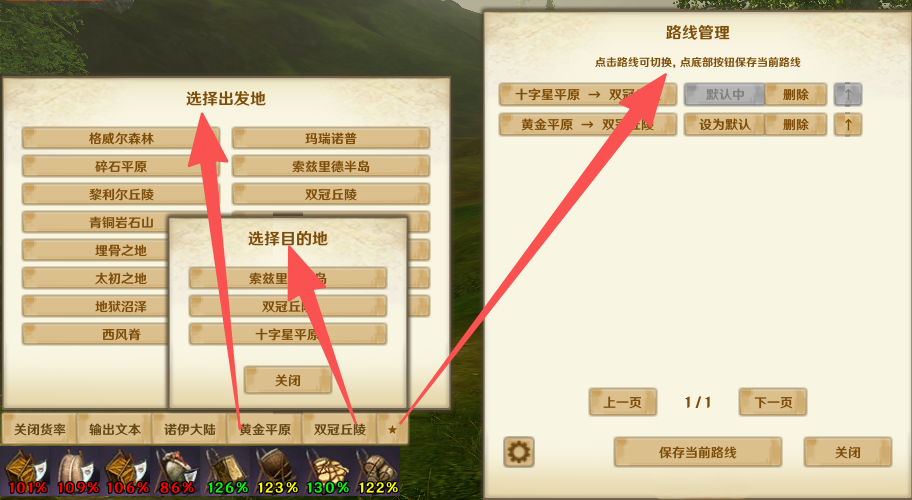</a>
  <a href="https://raw.githubusercontent.com/Yunxei/jingxia/main/assets/screenshots/packratio/preview-02.png">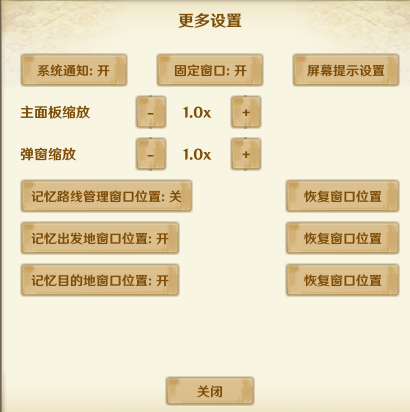</a>
  <a href="https://raw.githubusercontent.com/Yunxei/jingxia/main/assets/screenshots/packratio/preview-03.png">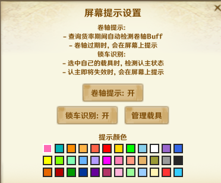</a>
</p>

<p>
  <a href="https://raw.githubusercontent.com/Yunxei/jingxia/main/assets/screenshots/packratio/preview-04.png"></a>
</p>

<picture></picture> **下载**

**packratio 2.7**

[](https://github.com/Yunxei/jingxia/releases/download/packratio-v2.7/packratio-2.7.zip)

<picture></picture> **更新记录**

`2.7`

当前正式发布版本。

</details>

<details>
<summary> speedometer 2.0 ｜ 载具速度显示</summary>

<a id="speedometer"></a>

<picture></picture> **插件说明**

用于显示载具速度，并调整速度显示的位置与样式。

<picture></picture> **主要功能**

- 载具行驶速度、转向速度与左右方向显示
- 显示 / 隐藏与位置调整
- 字号、文字颜色和描边设置
- 配置与位置保存

<p>
  <a href="https://raw.githubusercontent.com/Yunxei/jingxia/main/assets/screenshots/speedometer/preview-01.png">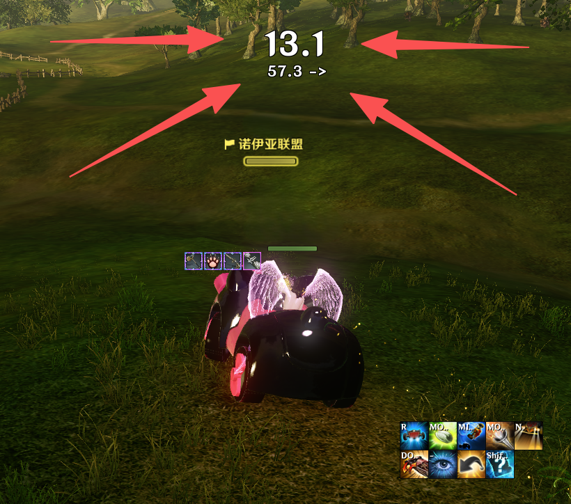</a>
  <a href="https://raw.githubusercontent.com/Yunxei/jingxia/main/assets/screenshots/speedometer/preview-02.png">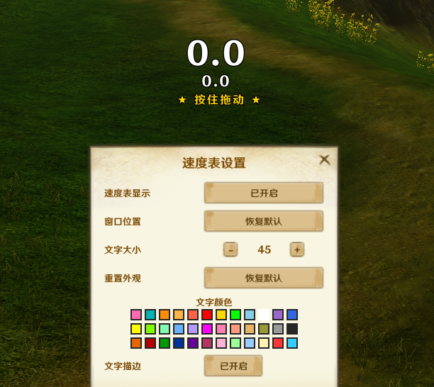</a>
</p>

<picture></picture> **下载**

**speedometer 2.0**

[](https://github.com/Yunxei/jingxia/releases/download/speedometer-v2.0/speedometer-2.0.zip)

<picture></picture> **前置插件**

需要前置插件：globals。

[](https://github.com/Yunxei/jingxia/releases/download/globals/globals.zip)

第一次安装需要同时安装 globals；已经安装过则无需重复安装。

<picture></picture> **更新记录**

`2.0`

当前正式发布版本。

</details>

<details>
<summary> ReloadButton 1.0 ｜ 快速重载插件</summary>

<a id="reloadbutton"></a>

<picture></picture> **插件说明**

在 ESC 菜单中提供重新加载插件的快捷入口。

<picture></picture> **主要功能**

- ESC 菜单快捷重载入口
- 10 秒重复操作冷却
- 防崩溃

<p>
  <a href="https://raw.githubusercontent.com/Yunxei/jingxia/main/assets/screenshots/ReloadButton/preview-01.png">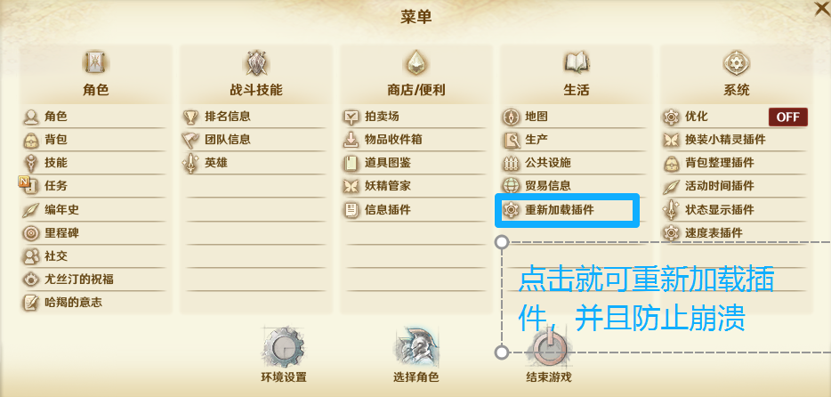</a>
</p>

<picture></picture> **下载**

**ReloadButton 1.0**

[](https://github.com/Yunxei/jingxia/releases/download/reloadbutton-v1.0/ReloadButton-1.0.zip)

<picture></picture> **更新记录**

`1.0`

当前正式发布版本。

</details>

<details>
<summary> Nyxaria 2.0 ｜ 背包整理</summary>

<a id="nyxaria"></a>

<picture></picture> **插件说明**

用于辅助背包与仓库整理，并提供物品保护及拍卖收藏功能。

<picture></picture> **主要功能**

- 将背包中符合条件的物品转存到仓库或箱子
- 物品保护清单与保留数量设置
- 整理快捷键设置
- 拍卖收藏
- 配置保存

<p>
  <a href="https://raw.githubusercontent.com/Yunxei/jingxia/main/assets/screenshots/Nyxaria/preview-01.png">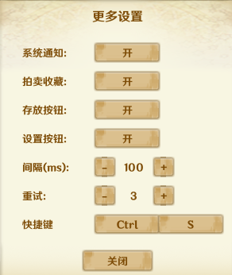</a>
  <a href="https://raw.githubusercontent.com/Yunxei/jingxia/main/assets/screenshots/Nyxaria/preview-02.png">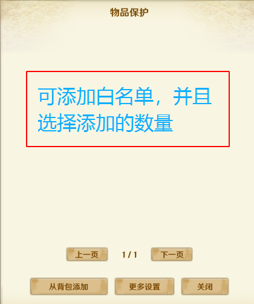</a>
  <a href="https://raw.githubusercontent.com/Yunxei/jingxia/main/assets/screenshots/Nyxaria/preview-03.png">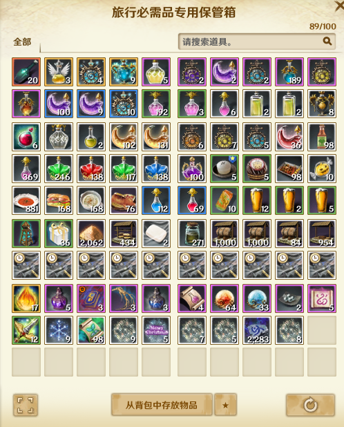</a>
</p>

<p>
  <a href="https://raw.githubusercontent.com/Yunxei/jingxia/main/assets/screenshots/Nyxaria/preview-04.png">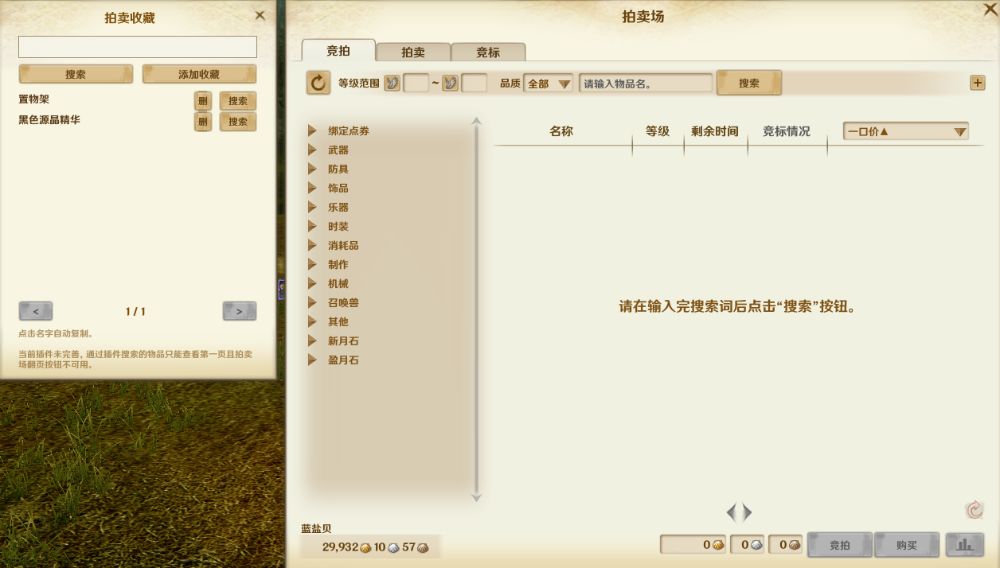</a>
</p>

<picture></picture> **下载**

**Nyxaria 2.0**

[](https://github.com/Yunxei/jingxia/releases/download/nyxaria-v2.0/Nyxaria-2.0.zip)

<picture></picture> **更新记录**

`2.0`

当前正式发布版本。

</details>

<details>
<summary> combatcloset 2.4 ｜ 装备与称号一键切换</summary>

<a id="combatcloset"></a>

<picture></picture> **插件说明**

用于保存和切换装备套装与称号及相关快捷设置。

<picture></picture> **主要功能**

- 装备套装与称号保存与切换
- 根据装备属性与签名匹配待换装备
- 专业时装提醒
- 热键设置
- 套装图标与界面设置
- 用户套装配置保存

<p>
  <a href="https://raw.githubusercontent.com/Yunxei/jingxia/main/assets/screenshots/combatcloset/preview-01.png">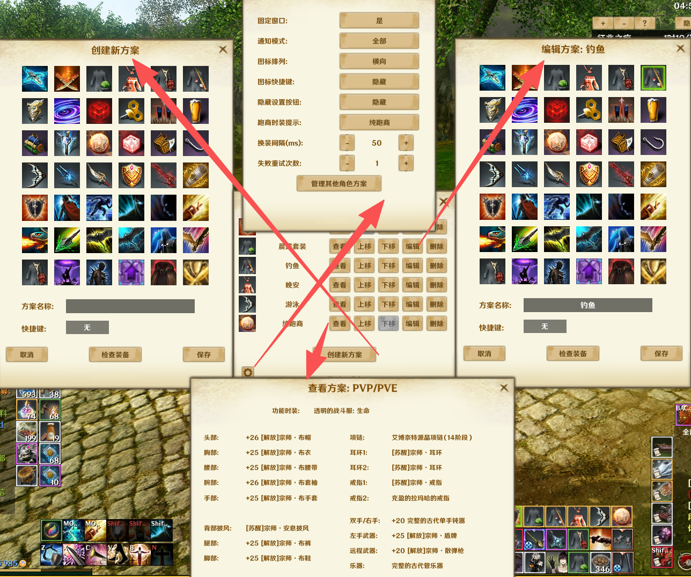</a>
  <a href="https://raw.githubusercontent.com/Yunxei/jingxia/main/assets/screenshots/combatcloset/preview-02.png">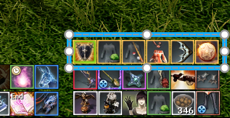</a>
  <a href="https://raw.githubusercontent.com/Yunxei/jingxia/main/assets/screenshots/combatcloset/preview-03.png">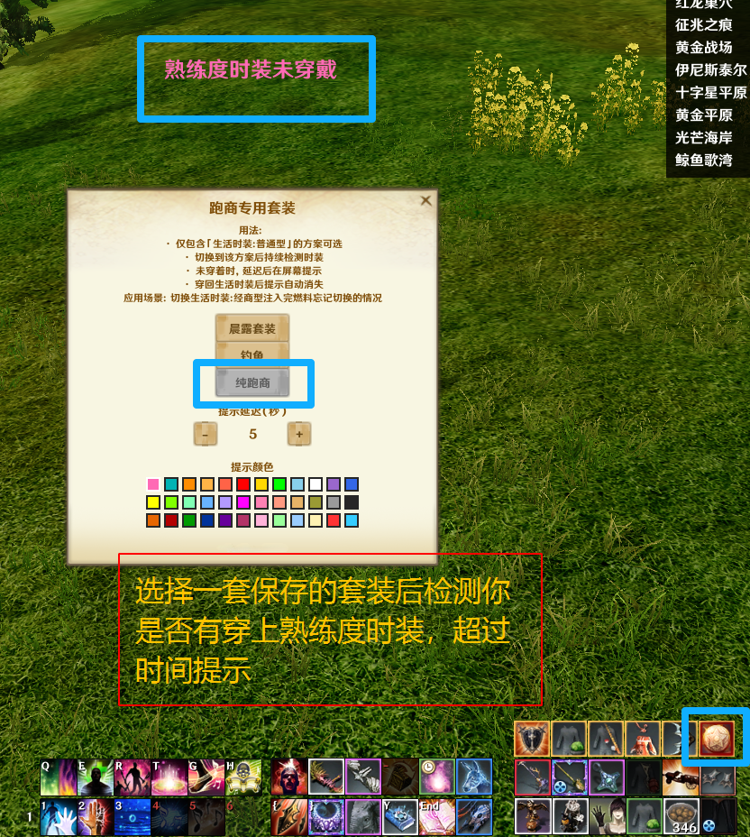</a>
</p>

<picture></picture> **下载**

**combatcloset 2.4**

[](https://github.com/Yunxei/jingxia/releases/download/combatcloset-v2.4/combatcloset-2.4.zip)

<picture></picture> **更新记录**

`2.4`

当前正式发布版本。

</details>
