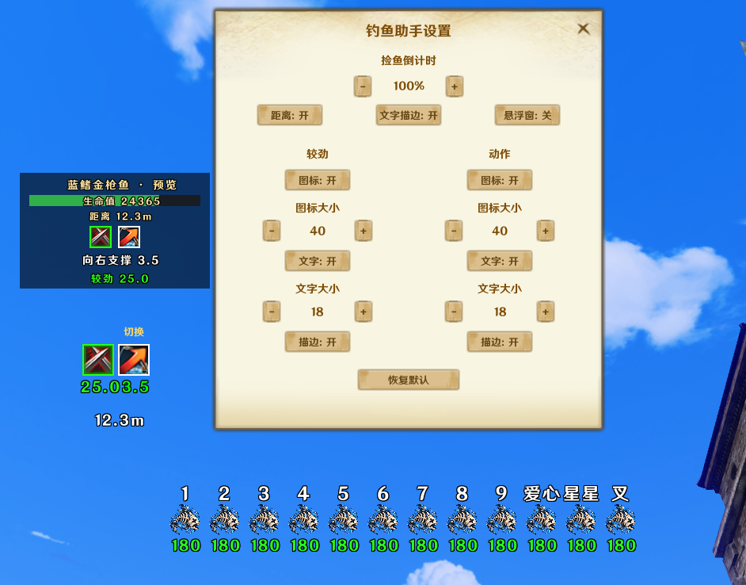
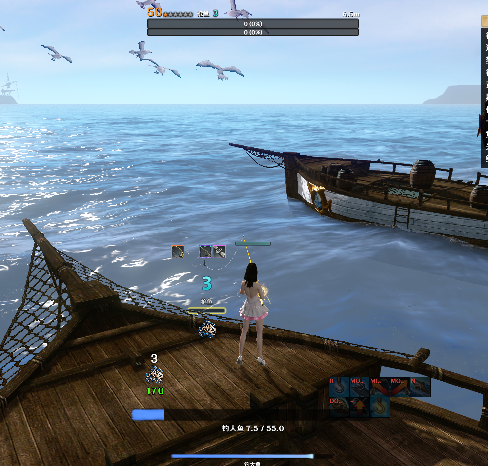

## 插件目录 <sub><a href="#user-content-installation">安装说明</a></sub>

| 插件 | 当前版本 | 更新时间 | 简介 | 下载 | 前置插件 |
| --- | --- | --- | --- | --- | --- |
| [globals](#user-content-globals) | — | — | 前置插件 | [](https://github.com/Yunxei/jingxia/releases/download/globals/globals.zip) | — |
| [TimeUntil](#user-content-timeuntil) | 4.9 | 2026-10-04 | 活动/地区时间 | [](https://github.com/Yunxei/jingxia/releases/download/timeuntil-v4.9/TimeUntil-4.9.zip) | globals |
| [Panoptes](#user-content-panoptes) | 1.3 | 2026-10-04 | 玩家状态追踪 | [](https://github.com/Yunxei/jingxia/releases/download/panoptes-v1.3/Panoptes-1.3.zip) | globals |
| [packratio](#user-content-packratio) | 2.8 | 2026-10-05 | 显示地区货率 | [](https://github.com/Yunxei/jingxia/releases/download/packratio-v2.8/packratio-2.8.zip) | — |
| [speedometer](#user-content-speedometer) | 2.1 | 2026-10-05 | 速度显示 | [](https://github.com/Yunxei/jingxia/releases/download/speedometer-v2.1/speedometer-2.1.zip) | globals |
| [ReloadButton](#user-content-reloadbutton) | 1.0 | 2026-10-04 | 快速重载插件 | [](https://github.com/Yunxei/jingxia/releases/download/reloadbutton-v1.0/ReloadButton-1.0.zip) | — |
| [Nyxaria](#user-content-nyxaria) | 2.0 | 2026-10-04 | 背包整理 | [](https://github.com/Yunxei/jingxia/releases/download/nyxaria-v2.0/Nyxaria-2.0.zip) | — |
| [combatcloset](#user-content-combatcloset) | 2.5 | 2026-10-05 | 装备与称号一键切换 | [](https://github.com/Yunxei/jingxia/releases/download/combatcloset-v2.5/combatcloset-2.5.zip) | — |
| [Angler](#user-content-angler) | 1.0 | 2026-10-06 | 钓鱼辅助 | [](https://github.com/Yunxei/jingxia/releases/download/angler-v1.0/Angler-1.0.zip) | globals |
<br>

> 点击下方插件详情标题展开详细说明。

<br>
<details>
<summary>安装说明</summary>

<a id="installation"></a>

```text
下载压缩包后解压文件夹，将文件夹放入：
X:\My Documents\ArcheRage\Addon

注意：
X 不是固定盘符，它代表你电脑上“文档”文件夹所在的盘。

不同系统：
• Win10/Win11 中文：文档
• Win7 中文：我的文档
• 英文系统：Documents / My Documents

请不要直接复制 X。

首次安装后：
1. 重新登录游戏，进入角色选择界面。
2. 点击界面右上角的扳手按钮，打开插件列表。
3. 勾选需要启用的插件，然后进入游戏。

更新已安装并启用的插件时，无需再次点击扳手按钮或勾选插件。

需要 globals 的插件，请同时安装 globals。
```

<hr>

**使用与设置**  
进入游戏后，可在 ESC 游戏菜单中打开对应插件的详细设置。  
多数插件支持调整界面位置、大小、字体和颜色，可按个人习惯自由搭配，具体以各插件设置为准。

<hr>
<hr>
<hr>

</details>

<details>
<summary> globals ｜ 前置插件</summary>

<a id="globals"></a>

- globals 是部分插件运行所需的前置插件
- 当前已确认 TimeUntil、Panoptes、speedometer 使用 globals
- 多个插件共用同一个 globals，只需安装一份

<picture></picture> **下载**

**globals** 

[](https://github.com/Yunxei/jingxia/releases/download/globals/globals.zip)

<hr>
<hr>
<hr>

</details>

<details>
<summary> TimeUntil 4.9 ｜ 活动/地区时间</summary>

<a id="timeuntil"></a>

<picture></picture> **插件说明**

用于查看地区状态、活动时间以及相关倒计时。

<picture></picture> **主要功能**

- 地区和平 / 纷争 / 战争时间显示
- 游戏活动时间与倒计时
- 部分活动的任务完成进度显示
- 自定义显示内容
- 活动显示数量设置
- 主界面显示 / 隐藏
- 配置与界面状态保存

<p>
  <a href="https://github.com/user-attachments/assets/8016ff07-c841-4f87-9c5a-e8a5ba173e84"></a>
  <a href="https://github.com/user-attachments/assets/e1152bcb-71c2-4c35-bb2b-b6eb0f44c774"></a>
  <a href="https://github.com/user-attachments/assets/b813b0c1-d967-4cee-8962-09bd14cd8e6f"></a>
</p>


<picture></picture> **下载**

**TimeUntil 4.9** 

[](https://github.com/Yunxei/jingxia/releases/download/timeuntil-v4.9/TimeUntil-4.9.zip)

<picture></picture> 需要前置插件：

[](https://github.com/Yunxei/jingxia/releases/download/globals/globals.zip)

第一次安装需要同时安装 globals；已经安装过则无需重复安装。

<picture></picture> **更新记录**

`4.9`

当前正式发布版本。

<hr>
<hr>
<hr>

</details>

<details>
<summary> Panoptes 1.3 ｜ 玩家状态追踪</summary>

<a id="panoptes"></a>

<picture></picture> **插件说明**

用于显示和追踪自身、目标的状态，提供悬浮面板、头顶标记和屏幕提示等辅助显示。

<picture></picture> **主要功能**

- 自身与目标状态追踪、剩余时间及层数显示
- 悬浮面板与头顶标记
- 目标信息、装备评分与距离显示
- 重要状态屏幕提示，以及自身 / 目标被扒皮等级提示
- 自身装备图标显示
- 大施法条显示与设置
- 进团时按职业自动设置团队职责
- 所有功能均可自由改变位置与开关
- 追踪清单管理与配置保存


<p>
  <a href="https://raw.githubusercontent.com/Yunxei/jingxia/main/assets/screenshots/Panoptes/preview-01.png"></a>
  <a href="https://raw.githubusercontent.com/Yunxei/jingxia/main/assets/screenshots/Panoptes/preview-02.png"></a>
  <a href="https://raw.githubusercontent.com/Yunxei/jingxia/main/assets/screenshots/Panoptes/preview-03.png"></a>
</p>

<p>
  <a href="https://raw.githubusercontent.com/Yunxei/jingxia/main/assets/screenshots/Panoptes/preview-04.png"></a>
  <a href="https://raw.githubusercontent.com/Yunxei/jingxia/main/assets/screenshots/Panoptes/preview-05.png"></a>
</p>

<picture></picture> **下载**

**Panoptes 1.3**

[](https://github.com/Yunxei/jingxia/releases/download/panoptes-v1.3/Panoptes-1.3.zip)

<picture></picture> **前置插件**

需要前置插件：globals。

[](https://github.com/Yunxei/jingxia/releases/download/globals/globals.zip)

第一次安装需要同时安装 globals；已经安装过则无需重复安装。

<picture></picture> **更新记录**

`1.3`

当前正式发布版本。

<hr>
<hr>
<hr>

</details>

<details>
<summary> packratio 2.8 ｜ 显示地区货率</summary>

<a id="packratio"></a>

<picture></picture> **插件说明**

用于查看地区贸易货率，管理贸易路线和相关提醒。

<picture></picture> **主要功能**

- 地区贸易货率显示
- 结合货率和经商熟练度估算货物售价，实际以交易所价格为准
- 贸易路线管理
- 卷轴与锁车提醒，支持关注目标和持续认主倒计时
- 屏幕提示实时预览、拖动定位、字号、颜色、描边与恢复默认
- 设置与管理窗口逐级返回
- 界面缩放、位置和配置保存

<p>
  <a href="https://raw.githubusercontent.com/Yunxei/jingxia/main/assets/screenshots/packratio/preview-01.png"></a>
  <a href="https://raw.githubusercontent.com/Yunxei/jingxia/main/assets/screenshots/packratio/preview-02.png"></a>
  <a href="https://raw.githubusercontent.com/Yunxei/jingxia/main/assets/screenshots/packratio/preview-03.png"></a>
</p>

<p>
  <a href="https://raw.githubusercontent.com/Yunxei/jingxia/main/assets/screenshots/packratio/preview-04.png"></a>
</p>

<picture></picture> **下载**

**packratio 2.8**

[](https://github.com/Yunxei/jingxia/releases/download/packratio-v2.8/packratio-2.8.zip)

<picture></picture> **更新记录**

`2.8` · 2026-10-05

- 优化锁车识别，现在当前目标和关注目标中的载具都能正常检测认主状态。
- 新增认主倒计时缓存：检测到载具认主剩余时间后，即使取消目标或切换到其他目标，认主倒计时也会继续显示。
- 认主倒计时结束后会继续显示“载具认主已失效”10 秒，随后自动清除提示。
- 优化卷轴过期提醒：卷轴过期后，如果连续 120 秒没有背货，提示会自动清除；重新背货后会取消清除计时。
- 完善屏幕提示设置：支持实时预览、拖动调整位置、修改文字大小和切换黑色描边。
- 屏幕提示的位置、文字大小、颜色和描边设置会自动保存。
- 新增恢复默认，可一键恢复屏幕提示的默认位置、文字大小、颜色和描边。
- 优化设置与管理窗口的操作方式：进入下一级设置时自动隐藏上一层窗口，关闭后返回上一层。
- 优化屏幕提示设置界面布局，并移除进入游戏时的“成功加载货率插件”提示。

`2.7`

原正式发布版本。

<hr>
<hr>
<hr>

</details>

<details>
<summary> speedometer 2.1 ｜ 速度显示</summary>

<a id="speedometer"></a>

<picture></picture> **插件说明**

用于显示载具及步行、坐骑、滑翔翼的移动速度，共用一个可自定义的速度表。

<picture></picture> **主要功能**

- 载具与非载具速度显示，分别设置开关并保存选择
- 非载具包含步行、坐骑和滑翔翼，默认关闭，可在设置中开启
- 一个速度表，只显示一位小数的速度数字
- 实时预览，可拖动调整位置
- 文字大小、颜色和黑色描边实时调整并保存
- 恢复默认位置与外观，保留显示开关

<p>
  <a href="https://raw.githubusercontent.com/Yunxei/jingxia/main/assets/screenshots/speedometer/preview-01.png"></a>
  <a href="https://raw.githubusercontent.com/Yunxei/jingxia/main/assets/screenshots/speedometer/preview-02.png"></a>
</p>

<picture></picture> **下载**

**speedometer 2.1**

[](https://github.com/Yunxei/jingxia/releases/download/speedometer-v2.1/speedometer-2.1.zip)

<picture></picture> **前置插件**

需要前置插件：globals。

[](https://github.com/Yunxei/jingxia/releases/download/globals/globals.zip)

第一次安装需要同时安装 globals；已经安装过则无需重复安装。

<picture></picture> **更新记录**

`2.1` · 2026-10-05

- 新增步行、坐骑和滑翔翼速度显示，默认关闭，可在设置中开启。
- 载具与非载具拥有独立显示开关，重进游戏后保留选择。
- 共用一个速度表，仅显示一位小数的速度数字，移除“移动”和单位文字。
- 重做速度表设置界面，布局更紧凑，各行居中排列。
- 打开设置即可实时预览，直接拖动预览调整屏幕位置。
- 文字大小、颜色和黑色描边实时生效，位置与外观自动保存。
- 统一为一个“恢复默认”，只重置位置与外观，不改变显示开关。

`2.0`

原正式发布版本。

<hr>
<hr>
<hr>

</details>

<details>
<summary> ReloadButton 1.0 ｜ 快速重载插件</summary>

<a id="reloadbutton"></a>

<picture></picture> **插件说明**

在 ESC 菜单中提供重新加载插件的快捷入口。

<picture></picture> **主要功能**

- ESC 菜单快捷重载入口
- 10 秒重复操作冷却
- 防崩溃

<p>
  <a href="https://raw.githubusercontent.com/Yunxei/jingxia/main/assets/screenshots/ReloadButton/preview-01.png"></a>
</p>

<picture></picture> **下载**

**ReloadButton 1.0**

[](https://github.com/Yunxei/jingxia/releases/download/reloadbutton-v1.0/ReloadButton-1.0.zip)

<picture></picture> **更新记录**

`1.0`

当前正式发布版本。

<hr>
<hr>
<hr>

</details>

<details>
<summary> Nyxaria 2.0 ｜ 背包整理</summary>

<a id="nyxaria"></a>

<picture></picture> **插件说明**

用于辅助背包与仓库整理，并提供物品保护及拍卖收藏功能。

<picture></picture> **主要功能**

- 将背包中符合条件的物品转存到仓库或箱子
- 物品保护清单与保留数量设置
- 整理快捷键设置
- 拍卖收藏
- 配置保存

<p>
  <a href="https://raw.githubusercontent.com/Yunxei/jingxia/main/assets/screenshots/Nyxaria/preview-01.png"></a>
  <a href="https://raw.githubusercontent.com/Yunxei/jingxia/main/assets/screenshots/Nyxaria/preview-02.png"></a>
  <a href="https://raw.githubusercontent.com/Yunxei/jingxia/main/assets/screenshots/Nyxaria/preview-03.png"></a>
</p>

<p>
  <a href="https://raw.githubusercontent.com/Yunxei/jingxia/main/assets/screenshots/Nyxaria/preview-04.png"></a>
</p>

<picture></picture> **下载**

**Nyxaria 2.0**

[](https://github.com/Yunxei/jingxia/releases/download/nyxaria-v2.0/Nyxaria-2.0.zip)

<picture></picture> **更新记录**

`2.0`

当前正式发布版本。

<hr>
<hr>
<hr>

</details>

<details>
<summary> combatcloset 2.5 ｜ 装备与称号一键切换</summary>

<a id="combatcloset"></a>

<picture></picture> **插件说明**

用于保存和切换装备套装与称号及相关快捷设置。

<picture></picture> **主要功能**

- 装备套装与称号保存与切换
- 根据装备属性与签名匹配待换装备
- 熟练度时装忘穿戴提醒
- 热键设置
- 套装图标与界面设置
- 用户套装配置保存

<p>
  <a href="https://raw.githubusercontent.com/Yunxei/jingxia/main/assets/screenshots/combatcloset/preview-01.png"></a>
  <a href="https://raw.githubusercontent.com/Yunxei/jingxia/main/assets/screenshots/combatcloset/preview-02.png"></a>
  <a href="https://raw.githubusercontent.com/Yunxei/jingxia/main/assets/screenshots/combatcloset/preview-03.png"></a>
</p>

<picture></picture> **下载**

**combatcloset 2.5**

[](https://github.com/Yunxei/jingxia/releases/download/combatcloset-v2.5/combatcloset-2.5.zip)

<picture></picture> **更新记录**

`2.5`

- 优化设置与管理窗口：进入下一级时自动隐藏上一层，关闭、取消或按 ESC 后返回上一层。
- 「熟练度时装未穿戴」提示新增实时预览，可直接拖动调整屏幕位置。
- 新增文字大小调整和黑色描边开关，描边默认开启。
- 提示位置、文字大小、颜色和描边选择会自动保存。
- 新增恢复默认，只恢复提示外观，不影响套装、提醒延迟和其他设置。

<hr>
<hr>
<hr>

</details>


<details>
<summary> Angler 1.0 ｜ 钓鱼动作与捡鱼倒计时</summary>

<a id="angler"></a>

<picture></picture> **插件说明**

钓鱼辅助插件，显示当前鱼的动作、较劲、生命值与距离，并记录带头顶标记的死鱼剩余拾取时间。通过 ESC 菜单中的「钓鱼辅助插件」打开设置。

<picture></picture> **主要功能**

- 显示鱼的动作、较劲图标与游戏 Buff 倒计时；较劲数字和边框随时间由绿逐渐变红。
- 捡鱼倒计时为 180 秒，支持数字 1～9、爱心、星星和叉，数字随剩余时间渐变，最后 10 秒保持红色。
- 动作与较劲的图标、文字分别支持开关、大小和描边设置；距离显示可独立开关，默认开启。
- 可选悬浮窗默认关闭，显示鱼名、生命值、动作、较劲及距离；可取得最大生命值时显示生命条。
- 设置中的捡鱼倒计时图标、动作/较劲和悬浮窗均为演示预览，可拖动并保存各预览区域的位置；关闭设置后预览退出。实战中的动作、较劲与距离跟随选中的鱼，拖动预览不会改变它们相对鱼的位置。捡鱼记录和悬浮窗则使用保存的屏幕位置。

<p>
  <a href="https://raw.githubusercontent.com/Yunxei/jingxia/main/assets/screenshots/angler/preview-01.png"></a>
  <a href="https://raw.githubusercontent.com/Yunxei/jingxia/main/assets/screenshots/angler/preview-02.png"></a>
</p>

<picture></picture> **下载**

**Angler 1.0**

[](https://github.com/Yunxei/jingxia/releases/download/angler-v1.0/Angler-1.0.zip)

<picture></picture> **前置插件**

[](https://github.com/Yunxei/jingxia/releases/download/globals/globals.zip)

第一次安装需要同时安装 globals；已经安装过则无需重复安装。

<picture></picture> **更新记录**

`1.0`

当前正式发布版本。

<hr>
<hr>
<hr>

</details>
